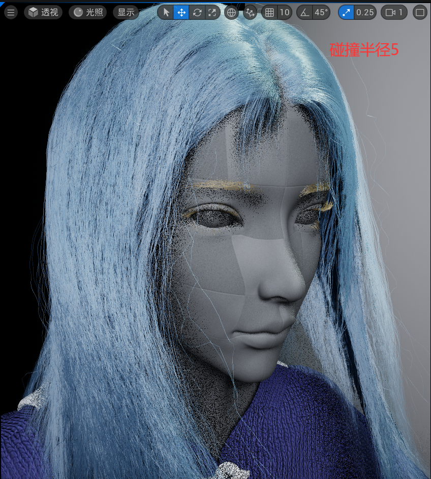

# 头发 Groom 物理参数解释

## 解算器设置 Solver Settings

启用模拟我们发现整个头发的模拟都是基于 Niagara 粒子来驱动的；但不需要担心，大多数情况下应用预设即可。

- **Groom Rods**：对于 **弯曲约束 Bend Constraint** 的表现更强，**拉伸约束** 表现较弱
- **Groom Springs**：对于 **拉伸约束 Stretch Constraint** 表现更强，**弯曲约束** 较弱
- **Custom Solver**：通过自定义 Niagara 系统来驱动，可以兼顾弹力和弯曲，但自定义过程复杂

---

- **Sub Steps**：每帧计算次数；如果该数值过低在运行时会丢失大量细节
- **Iteration**：迭代次数

这两个参数共同控制 **材质约束 Material Constraints** 中的细节程度。

## 外力 External Forces

如属性标签所示，无需赘述。

## 材质约束 Material Constraints

### 弯曲约束 Bend Constraint

**解算弯曲 Solve Bend**：根据 guide 信息产生的约束来单独解算

**投射弯曲 Project Bend**：顶点之间相关信息的约束解算

- **弯曲阻尼 Bend Damping**：变形后恢复的速度
- **弯曲刚度 Bend Stiffness**：变形的幅度，数值越大幅度越小
- **刚度曲线 Stiffness Scale**：基于 **弯曲刚度** 变形幅度曲线（X轴 0 是发根，1 是发尖）

### 拉伸约束 Stretch Constraint

同上 **弯曲约束 Bend Constraint**，只是变为了拉伸效果。

### 碰撞约束 Collision Constraint

- **解算碰撞 Solve Collision**：根据 guide 信息产生的约束来单独解算
- **投射碰撞 Project Collision**：顶点之间相关信息的约束解算，建议勾选，防止出现 Groom 穿插
- **静态摩擦力 Static Friction**：静止时和碰撞体 **Physics Asset** 交互时的摩擦力，主要是身体和肩部
- **动态摩擦力 Kinetic Friction**：动态时和碰撞体 **Physics Asset** 交互时的摩擦力，主要是身体和肩部
- **发束黏度 Strands Viscosity**：(0~1 之间) 头发之间的自碰撞粘黏的系数，数值越大越会感觉头发是一个整体，而不是一根一根的
- **网格尺寸 Grid Dimension**：暂未知具体用处
- **碰撞半径 Collision Radius**：头发自身之间以及和身体的碰撞半径

- **半径缩放 Radius Scale**：基于 **碰撞半径** 变形幅度曲线（X轴 0 是发根，1 是发尖）

## 发束参数 Strands Parameters

- **发束尺寸 Strands Size**：每个 guide 上用于模拟的粒子数
- **发束密度 Strands Density**：用于质量和惯性计算
- **发束平滑 Strands Smoothing**：基于 **发束尺寸 Strands Size** 的粒子数进行插值平滑
- **发束粗度 Strands Thickness**：用于质量和惯性计算
- **粗度尺寸曲线 Thickness Scale**：基于 **弯曲刚度** 变形幅度曲线（X轴 0 是发根，1 是发尖）
