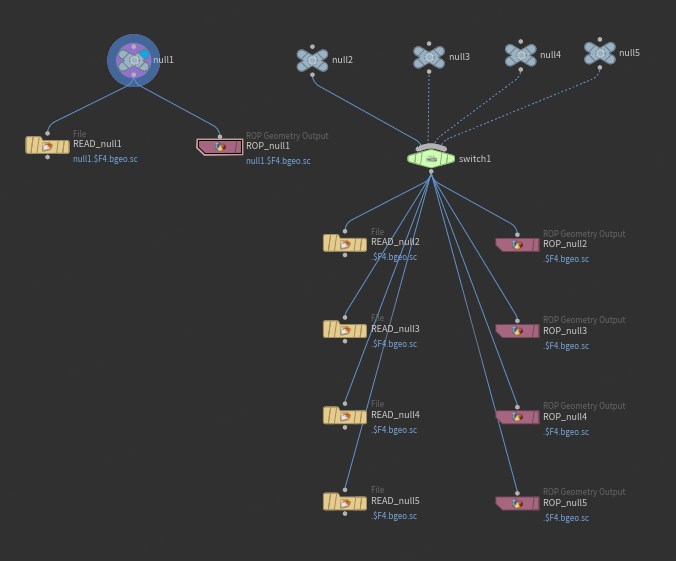

# 从switch创建输出组



```python
selNodes = hou.selectedNodes()
i = 0
j = 1

for nodeL in selNodes:
    inNode = nodeL.inputs()
    sum = len(inNode)
    if sum > 1:
        inputPath = nodeL.parm('input').path()
        i = 0  # 重新初始化计数器
        while i < sum:
            hip_01 = "$HIP/$HIPNAME/geo/source{}/{}.$F4.bgeo.sc".format("`chs(source)`", "")
            i += 1  # 在循环内部递增计数器
            inputNode = inNode[i-1]
            inputName = inNode[i-1].name()
            parmPath = "hou.parm('{}').set({})".format(inputPath, i-1)

            posx = nodeL.position()[0]
            posy = nodeL.position()[1]
            # 创建缓存节点
            createNode = nodeL.createOutputNode("rop_geometry")
            createNode.setName("ROP_" + inputName, 1)
            createNode.setPosition([posx + 2, posy - (i * 2)])
            createNode.parm("trange").set(1)
            createNode.parm("f1").deleteAllKeyframes()
            createNode.parm("f2").deleteAllKeyframes()

            # 创建一个参数模板组
            group = createNode.parmTemplateGroup()
            # 创建一个整数参数模板，用于表示输入来源编号
            parmt = hou.IntParmTemplate("source", "Source", 1)
            # 将参数模板插入到参数模板组中，在 "trange" 参数之前
            group.insertBefore("trange", parmt)
            # 将更新后的参数模板组应用到当前节点上
            createNode.setParmTemplateGroup(group)

            createNode.parm("source").set(i-1)
            createNode.parm("sopoutput").set(hip_01)
            createNode.parm("prerender").set(parmPath)
            
            fileNode = nodeL.createOutputNode("file")
            fileNode.setName("READ_" + inputName, 1)
            fileNode.setPosition([posx - 2, posy - (i * 2)])
            
            group = fileNode.parmTemplateGroup()
            src = hou.IntParmTemplate("source", "Source", 1)
            group.insertBefore("filemode", src)
            fileNode.setParmTemplateGroup(group)
            
            fileNode.parm("source").set(i-1)
            fileNode.parm("file").set(hip_01)
    
    elif j == 1:
        while i < j:
            i += 1
            
            inputName = nodeL.name()
            hip_02 = "$HIP/$HIPNAME/geo/{}.$F4.bgeo.sc".format(inputName)
            
            posx = nodeL.position()[0]
            posy = nodeL.position()[1]
            
            createNode = nodeL.createOutputNode("rop_geometry")
            createNode.setName("ROP_" + inputName, 1)
            createNode.setPosition([posx + 2, posy - (i * 2)])
            createNode.parm("trange").set(1)
            createNode.parm("f1").deleteAllKeyframes()
            createNode.parm("f2").deleteAllKeyframes()
            
            group = createNode.parmTemplateGroup()
            src = hou.IntParmTemplate("source", "Source", 1)
            group.insertBefore("trange", src)
            
            createNode.setParmTemplateGroup(group)
            createNode.parm("source")
            createNode.parm("sopoutput").set(hip_02)
            
            fileNode = nodeL.createOutputNode("file")
            fileNode.setName("READ_" + inputName, 1)
            fileNode.setPosition([posx - 2, posy - (i * 2)])
            
            group = fileNode.parmTemplateGroup()
            src = hou.IntParmTemplate("source", "Source", 1)
            group.insertBefore("filemode", src)
            fileNode.setParmTemplateGroup(group)
            
            fileNode.parm("source").set(i-1)
            fileNode.parm("file").set(hip_02)
```