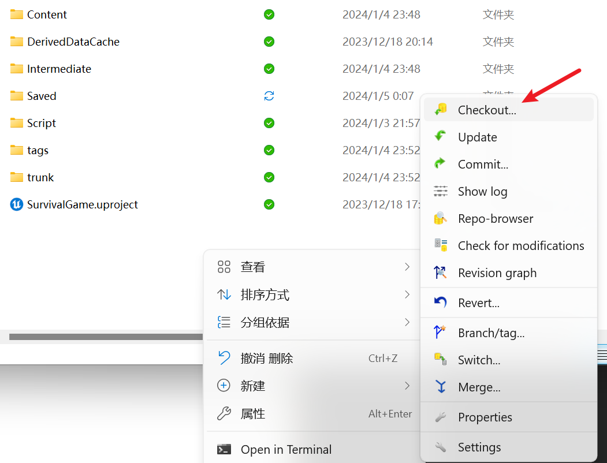

# Unreal SVN 仓库搭建指北

本教程介绍如何为 Unreal Engine 项目搭建 SVN 版本控制仓库。

## 1. 下载安装 TortoiseSVN

点击链接进入 SVN 下载页面，选择对应操作系统下载。系统位数可通过 **系统 → 系统信息** 查看。

🔗 [TortoiseSVN 下载页面](https://tortoisesvn.net/downloads.html)


## 2. 安装并创建仓库目录

一路下一步安装之后根据提示，**重启电脑**。

选择一个硬盘，新建一个"装管理项目仓库的仓库"。

> ⚠️ **注意**：不可以在根目录创建仓库。


进入该文件夹，在导航栏输入 `CMD` 并回车进入该路径的命令行窗口。

> 📹 操作演示视频：[bandicam_2024-01-05_00-19-36-100.mp4](images/bandicam_2024-01-05_00-19-36-100.mp4)


## 3. 使用 UE 内置 SVN 创建仓库

在命令行中输入以下命令：

```cmd
"C:\Program Files\Epic Games\UE_5.2\Engine\Binaries\ThirdParty\svn\Win64\svnadmin.exe" create --compatible-version 1.9 E:\BaiduSyncdisk\SVN_Repos
```

**参数说明：**

- **第一个路径**：UE 引擎内部自带的 SVN 内核路径，可通过 Everything 搜索 `svnadmin.exe` 找到

  

- **第二个路径**：`E:\SVN_Repos\Survival_Repo` 代表想创建的仓库所在的路径和文件名

> 💡 **为什么使用 UE 自带的 SVN？**
> UE 自带的 SVN 内核版本较老，而我们下载的 TortoiseSVN 版本较新。使用新版本创建的仓库可能无法与 UE 项目内部正确链接。

复制命令至命令行后回车即可创建仓库。

## 4. Checkout 到 UE 项目

打开 UE 项目路径：



右键选择 **SVN → Checkout**：

- **第一行**：填写刚才通过命令行创建的仓库路径，在前面加上 `file:///`
- **第二行**：填写想要进行版本控制的 UE 项目路径，删除自动生成的后缀

点击 **OK → Checkout** 即可完成。


## 5. 在 UE 中配置 Source Control

1. 进入 UE 项目
2. 点击右下角 **Source Control Off**
3. 选择 **Subversion**
4. 将仓库路径复制到对应位置
5. 点击 **Accept Settings**


## 6. 完成

配置完成后，你的 UE 项目已成功连接 SVN 版本控制。


---

## 参考资源

- [TortoiseSVN 官网](https://tortoisesvn.net/)
- [Unreal Engine 官方文档](https://docs.unrealengine.com/)
