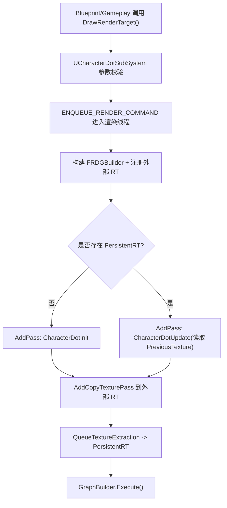

# UE5 Compute Shader：基于 `Plugins/CharacterDot` 从 0 到 1

我们不讲空泛概念，直接结合你项目里 `Plugins/CharacterDot` 的真实代码，走一遍完整链路：

1. 为什么要用 Compute Shader
2. UE 里一个 Compute Shader 从注册到调度是怎么跑起来的
3. 你这个插件是如何用 `Init + Update` 两个 Pass 做出"带拖尾的角色圆点图"
4. 新人可以直接照着做的上手步骤和避坑清单

---

## 1. 为什么要用 Compute Shader？

先说结论：**当你要在 GPU 上做"可并行的数据计算"，而且结果不一定是传统光栅化渲染（例如写纹理、做仿真、做后处理中间数据）时，Compute Shader 是最合适的工具。**

在这个项目里，它被用来做一张 `R32_FLOAT` Render Target 的实时写入：

- 每个像素独立计算到角色位置的距离，得到一个圆形遮罩（`Mask`）
- 后续帧读取上一帧纹理，做邻域采样 + 衰减，形成拖尾扩散效果

这类工作如果放在 CPU 上逐像素跑，代价高；而 GPU 天然适合"海量像素并行"。

---

## 2. 先看工程结构：这个插件由两层模块组成

关键文件：

- `Plugins/CharacterDot/CharacterDot.uplugin`
- `Plugins/CharacterDot/Source/CharacterDot/*`
- `Plugins/CharacterDot/Source/CharacterDotShaders/*`
- `Plugins/CharacterDot/Shaders/Private/*.usf`

`CharacterDot.uplugin` 里有两个 Runtime 模块：

- `CharacterDot`：业务层（LocalPlayerSubsystem、蓝图接口、调度入口）
- `CharacterDotShaders`：Shader 层（注册 Shader 目录、定义/编译/调度 Global Shader）

而且 `CharacterDotShaders` 的 `LoadingPhase` 是 `PostConfigInit`，这是 Compute Shader 项目常见做法：  
**让 Shader 映射尽早建立，避免后续找不到 `.usf` 路径。**

真实配置如下（来自工程原文件）：

```json
{
  "FileVersion": 3,
  "Version": 1,
  "VersionName": "1.0",
  "Modules": [
    {
      "Name": "CharacterDot",
      "Type": "Runtime",
      "LoadingPhase": "Default"
    },
    {
      "Name": "CharacterDotShaders",
      "Type": "Runtime",
      "LoadingPhase": "PostConfigInit"
    }
  ]
}
```

```csharp
public class CharacterDot : ModuleRules
{
	public CharacterDot(ReadOnlyTargetRules Target) : base(Target)
	{
		PrivateDependencyModuleNames.AddRange(
			new string[]
			{
				"CoreUObject",
				"Engine",
				"Slate",
				"SlateCore",
				"RHI",
				"RenderCore",
                "CharacterDotShaders"
			}
		);
	}
}
```

```csharp
public class CharacterDotShaders: ModuleRules
{
    public CharacterDotShaders(ReadOnlyTargetRules Target) : base(Target)
    {
        PrivateDependencyModuleNames.AddRange(new string[] {"Core", "CoreUObject", "Engine","RHI","RenderCore","Projects",});
    }
}
```

---

## 3. Shader 文件是怎么被 UE 找到的？

看 `Plugins/CharacterDot/Source/CharacterDotShaders/Private/CharacterDotShadersModule.cpp`：

```cpp
FString PluginShaderDir = FPaths::Combine(
    IPluginManager::Get().FindPlugin(TEXT("CharacterDot"))->GetBaseDir(),
    TEXT("Shaders/Private")
);
AddShaderSourceDirectoryMapping(TEXT("/CharacterDotShaders"), PluginShaderDir);
```

这段代码把虚拟路径 `/CharacterDotShaders` 映射到插件真实目录。  
所以你在 `IMPLEMENT_GLOBAL_SHADER` 里写：

```cpp
"/CharacterDotShaders/CharacterDotInit.usf"
```

引擎就能定位到：

`Plugins/CharacterDot/Shaders/Private/CharacterDotInit.usf`

---

## 4. Compute Shader 在 C++ 侧的标准写法（本项目实战版）

### 4.1 定义一个 `FGlobalShader` 类

例如 `Shader_CharacterDotInit.cpp` 里的 `FCharacterDotInitCS`：

- `SHADER_USE_PARAMETER_STRUCT`：使用参数结构体绑定
- `BEGIN_SHADER_PARAMETER_STRUCT`：声明 C++ 传给 USF 的参数
- `NUM_THREADS_X/Y = 8`：定义线程组尺寸
- `ShouldCompilePermutation`：限制到支持的平台（这里是 SM5）
- `ModifyCompilationEnvironment`：把 `NUM_THREADS_X/Y` 传给 USF 的宏

真实代码如下：

```cpp
class FCharacterDotInitCS : public FGlobalShader
{
	DECLARE_EXPORTED_SHADER_TYPE(FCharacterDotInitCS, Global, CHARACTERDOTSHADERS_API);
	SHADER_USE_PARAMETER_STRUCT(FCharacterDotInitCS, FGlobalShader);

	BEGIN_SHADER_PARAMETER_STRUCT(FParameters, )
		SHADER_PARAMETER(uint32, Resolution)
		SHADER_PARAMETER(FVector2f, Scale)
		SHADER_PARAMETER(FVector2f, Origin)
		SHADER_PARAMETER(FVector2f, Location)
		SHADER_PARAMETER(float, Radius)
		SHADER_PARAMETER_RDG_TEXTURE_UAV(RWTexture2D<float>, OutTexture)
	END_SHADER_PARAMETER_STRUCT()

public:
	static constexpr uint32 NUM_THREADS_X = 8;
	static constexpr uint32 NUM_THREADS_Y = 8;

	static bool ShouldCompilePermutation(const FGlobalShaderPermutationParameters& Parameters)
	{
		return IsFeatureLevelSupported(Parameters.Platform, ERHIFeatureLevel::SM5);
	}

	static void ModifyCompilationEnvironment(const FGlobalShaderPermutationParameters& Parameters, FShaderCompilerEnvironment& OutEnvironment)
	{
		FGlobalShader::ModifyCompilationEnvironment(Parameters, OutEnvironment);
		OutEnvironment.SetDefine(TEXT("NUM_THREADS_X"), NUM_THREADS_X);
		OutEnvironment.SetDefine(TEXT("NUM_THREADS_Y"), NUM_THREADS_Y);
	}
};
```

### 4.2 把类注册给引擎编译系统

```cpp
IMPLEMENT_GLOBAL_SHADER(
    FCharacterDotInitCS,
    "/CharacterDotShaders/CharacterDotInit.usf",
    "CharacterDotInit",
    SF_Compute
);
```

含义：

- 第 1 个参数：C++ Shader 类
- 第 2 个参数：USF 路径
- 第 3 个参数：USF 入口函数名
- 第 4 个参数：着色器阶段（Compute）

### 4.3 在渲染线程提交 Pass

`FCharacterDotInitShaderInterface::AddPass_RenderThread(...)` 和  
`FCharacterDotUpdateShaderInterface::AddPass_RenderThread(...)` 都做了同一件事：

1. `TShaderMapRef` 取到编译好的 Shader
2. `AllocParameters` 填参数
3. 算 `GroupCount = ceil(Resolution / 8)`
4. `FComputeShaderUtils::AddPass(...)` 提交到 RDG

`Init Pass` 真实代码：

```cpp
void FCharacterDotInitShaderInterface::AddPass_RenderThread
(
	FRDGBuilder& GraphBuilder,
	FGlobalShaderMap* InShaderMap,
	uint32 InResolution,
	const FVector2f InScale,
	const FVector2f InOrigin,
	const FVector2f InLocation,
	float InRadius,
	FRDGTextureRef InTextureRef
)
{
	ensure(IsInRenderingThread());
	RDG_EVENT_SCOPE(GraphBuilder, "CharacterDot");
	TShaderMapRef<FCharacterDotInitCS> ComputeShader(InShaderMap);
	FCharacterDotInitCS::FParameters* PassParameters = GraphBuilder.AllocParameters<FCharacterDotInitCS::FParameters>();
	PassParameters->Resolution = InResolution;
	PassParameters->Scale = InScale;
	PassParameters->Origin = InOrigin;
	PassParameters->Location = InLocation;
	PassParameters->Radius = InRadius;
	PassParameters->OutTexture = GraphBuilder.CreateUAV(InTextureRef);

	const FIntVector GroupCount(
		FMath::DivideAndRoundUp(InResolution, FCharacterDotInitCS::NUM_THREADS_X),
		FMath::DivideAndRoundUp(InResolution, FCharacterDotInitCS::NUM_THREADS_Y),
		1
	);

	FComputeShaderUtils::AddPass(
		GraphBuilder,
		RDG_EVENT_NAME("CharacterDotInit"),
		ERDGPassFlags::Compute | ERDGPassFlags::NeverCull,
		ComputeShader,
		PassParameters,
		GroupCount
	);
}
```

`Update Pass` 真实代码（注意 `PreviousTexture` 用的是 SRV）：

```cpp
void FCharacterDotUpdateShaderInterface::AddPass_RenderThread(
    FRDGBuilder& GraphBuilder,
    FGlobalShaderMap* InShaderMap,
    uint32 InResolution,
    const FVector2f InScale,
    const FVector2f InOrigin,
    const FVector2f InLocation,
    float InRadius,
    float InFadeAmount,
    FRDGTextureRef InPreviousTextureRef,
    FRDGTextureRef InOutTextureRef
)
{
    ensure(IsInRenderingThread());
    RDG_EVENT_SCOPE(GraphBuilder, "CharacterDotUpdate");

    TShaderMapRef<FCharacterDotUpdateCS> ComputeShader(InShaderMap);
    FCharacterDotUpdateCS::FParameters* PassParameters = GraphBuilder.AllocParameters<FCharacterDotUpdateCS::FParameters>();

    PassParameters->Resolution  = InResolution;
    PassParameters->Scale       = InScale;
    PassParameters->Origin      = InOrigin;
    PassParameters->Location    = InLocation;
    PassParameters->Radius      = InRadius;
    PassParameters->FadeAmount  = InFadeAmount;
    PassParameters->PreviousTexture = GraphBuilder.CreateSRV(FRDGTextureSRVDesc(InPreviousTextureRef));
    PassParameters->OutTexture  = GraphBuilder.CreateUAV(InOutTextureRef);

    const FIntVector GroupCount(
        FMath::DivideAndRoundUp(InResolution, FCharacterDotUpdateCS::NUM_THREADS_X),
        FMath::DivideAndRoundUp(InResolution, FCharacterDotUpdateCS::NUM_THREADS_Y),
        1
    );

    FComputeShaderUtils::AddPass(
        GraphBuilder,
        RDG_EVENT_NAME("CharacterDotUpdate"),
        ERDGPassFlags::Compute | ERDGPassFlags::NeverCull,
        ComputeShader,
        PassParameters,
        GroupCount
    );
}
```

---

## 5. 这套插件真正的"调度入口"：`UCharacterDotSubSystem`

关键文件：`Plugins/CharacterDot/Source/CharacterDot/Private/CharacterDotSubSystem.cpp`

这部分是新人最该看的，因为它把"游戏线程 -> 渲染线程 -> RDG -> Compute"完整串起来了。

### 5.1 游戏线程做参数和资源校验

`DrawRenderTarget()` 先检查：

- `RT` 是否有效
- 尺寸是否是正方形
- 格式是否 `PF_R32_FLOAT`
- `Radius/Scale` 是否有效
- `World / LocalPlayer / Pawn` 是否有效

这一步非常重要：**很多 Compute Shader 问题不是 shader 算错，而是输入资源不合法。**

对应的真实校验代码：

```cpp
if (!RT.IsValid())
{
	UE_LOG(LogTemp, Error, TEXT("Invalid Render Target"));
	return false;
}

FTextureRenderTargetResource* RTResource = RT.Get()->GameThread_GetRenderTargetResource();
if (!RTResource)
{
	UE_LOG(LogTemp, Error, TEXT("Invalid Render Target Resource"));
	return false;
}

const int32 Resolution = RT.Get()->SizeX;
if (Resolution <= 0)
{
	UE_LOG(LogTemp, Error, TEXT("Invalid Render Target Width"));
	return false;
}

if (RT.Get()->SizeY != Resolution)
{
	UE_LOG(LogTemp, Error, TEXT("Render Target Non Square"));
	return false;
}

if (RT.Get()->GetFormat() != PF_R32_FLOAT)
{
	UE_LOG(LogTemp, Error, TEXT("Invalid Render Target Format: %s"), *UEnum::GetValueAsName(RT.Get()->GetFormat()).ToString());
	return false;
}
```

### 5.2 进入渲染线程执行 RDG

```cpp
ENQUEUE_RENDER_COMMAND(CharacterDot)(
	[LocationCopy, ScaleCopy, OriginCopy, RadiusCopy, Resolution, RTResource, FeatureLevel, FadeAmountCopy, bHasPersistent, PersistentRTPtr](FRHICommandListImmediate& RHICmdList)
	{
		FRDGBuilder GraphBuilder(RHICmdList);
		FGlobalShaderMap* GlobalShaderMap = GetGlobalShaderMap(FeatureLevel);

		FRHITexture* TextureRHI = RTResource->GetRenderTargetTexture();
		FRDGTextureRef RDGTexture = GraphBuilder.RegisterExternalTexture(CreateRenderTarget(TextureRHI, TEXT("CharacterDotRT")));

		FRDGTextureDesc OutputTextureDesc = FRDGTextureDesc::Create2D(FIntPoint(Resolution, Resolution), PF_R32_FLOAT, FClearValueBinding::Black, TexCreate_ShaderResource | TexCreate_UAV);
		FRDGTextureRef RDGOutputTexture = GraphBuilder.CreateTexture(OutputTextureDesc, TEXT("CharacterDotOutputRT"));
		if (!bHasPersistent)
		{
			FCharacterDotInitShaderInterface::AddPass_RenderThread(GraphBuilder, GlobalShaderMap, Resolution, ScaleCopy, OriginCopy, LocationCopy, RadiusCopy, RDGOutputTexture);
		}
		else
		{
			FRDGTextureRef PreviousRDGTexture = GraphBuilder.RegisterExternalTexture(*PersistentRTPtr, TEXT("CharacterDotPersistentRT"));
			FCharacterDotUpdateShaderInterface::AddPass_RenderThread(GraphBuilder, GlobalShaderMap, Resolution, ScaleCopy, OriginCopy, LocationCopy, RadiusCopy, FadeAmountCopy, PreviousRDGTexture, RDGOutputTexture);
		}
		AddCopyTexturePass(GraphBuilder, RDGOutputTexture, RDGTexture);
		GraphBuilder.QueueTextureExtraction(RDGOutputTexture, PersistentRTPtr);
		GraphBuilder.Execute();
	}
);
```

上面这段是 `CharacterDotSubSystem.cpp` 里的真实调度代码（仅删除了注释），可以直接和工程对照。

这里做了 3 件核心事情：

1. 把外部 RT（`RTResource->GetRenderTargetTexture()`）注册成 RDG 纹理  
2. 创建一张 RDG 输出纹理 `RDGOutputTexture`  
3. 根据是否有历史纹理，走不同 Compute Pass

逻辑分支：

- 第 1 帧（无持久化历史）：`CharacterDotInit`
- 后续帧（有历史）：`CharacterDotUpdate`（读取上一帧并衰减）

然后：

- `AddCopyTexturePass`：把 RDG 输出拷回外部 RT（给材质/蓝图使用）
- `QueueTextureExtraction`：把当前 RDG 输出提取到 `PersistentRT`，供下一帧作为 `PreviousTexture`

这就是"帧间状态保留"的关键。

---

## 6. USF 里到底算了什么？

### 6.1 `CharacterDotInit.usf`

每个线程处理一个像素：

1. 用 `DispatchThreadID.xy` 定位像素
2. 转成 UV，再映射到世界坐标平面（`Scale + Origin`）
3. 计算与角色位置 `Location` 的距离
4. 输出径向遮罩 `Mask = 1 - saturate(distance / Radius)`

真实代码：

```hlsl
uint Resolution;
float2 Scale;
float2 Origin;
float2 Location;
float Radius;
RWTexture2D<float> OutTexture;

[numthreads(NUM_THREADS_X,NUM_THREADS_Y,1)]
void CharacterDotInit(uint3 DispatchThreadID : SV_DispatchThreadID)
{
    if (DispatchThreadID.x >= Resolution || DispatchThreadID.y >= Resolution)
    {
        return;
    }
    
    const float TexelSize = 1.0 / float(Resolution);
    const float U = (DispatchThreadID.x + 0.5) / float(Resolution);
    const float V = (DispatchThreadID.y + 0.5) / float(Resolution);
    
    const float X = ((U - 0.5) * Scale.x) + Origin.x;
    const float Y = ((V - 0.5) * Scale.y) + Origin.y;
    
    const float Mask = 1.0 - saturate(length(float2(X, Y) - Location) / Radius);
    
    OutTexture[DispatchThreadID.xy] = Mask;
}
```

### 6.2 `CharacterDotUpdate.usf`

在 Init 的基础上，多了历史融合：

1. 读取上一帧四邻域（左/右/上/下，带环绕）
2. 求均值并乘 `FadeAmount` 做衰减
3. `OutTexture = max(CurrentMask, PreviousBlurredMask)`

结果就是"当前点位 + 历史拖尾"的动态效果。

真实代码：

```hlsl
uint Resolution;
float2 Scale;
float2 Origin;
float2 Location;
float Radius;
float FadeAmount;
Texture2D<float> PreviousTexture;
RWTexture2D<float> OutTexture;

[numthreads(NUM_THREADS_X, NUM_THREADS_Y, 1)]
void CharacterDotUpdate(uint3 DispatchThreadID : SV_DispatchThreadID)
{
    if (DispatchThreadID.x >= Resolution || DispatchThreadID.y >= Resolution)
    {
        return;
    }
    
    const float TexelSize = 1.0 / float(Resolution);
    const float U = (DispatchThreadID.x + 0.5) / float(Resolution);
    const float V = (DispatchThreadID.y + 0.5) / float(Resolution);
    
    const float X = ((U - 0.5) * Scale.x) + Origin.x;
    const float Y = ((V - 0.5) * Scale.y) + Origin.y;
    
    const float Mask = 1.0 - saturate(length(float2(X, Y) - Location) / Radius);
    
    int NeighborY = DispatchThreadID.y;
    int NeighborX = DispatchThreadID.x - 1;
    if (NeighborX < 0){NeighborX += Resolution;}
    const float PreviousMask_L = PreviousTexture[uint2(NeighborX, NeighborY)];
    
    NeighborX = DispatchThreadID.x + 1;
    if (NeighborX >= Resolution){NeighborX -= Resolution;}
    const float PreviousMask_R = PreviousTexture[uint2(NeighborX, NeighborY)];
    
    NeighborX = DispatchThreadID.x;
    NeighborY = DispatchThreadID.y + 1;
    if (NeighborY >= Resolution){NeighborY -= Resolution;}
    const float PreviousMask_U = PreviousTexture[uint2(NeighborX, NeighborY)];
    
    NeighborY = DispatchThreadID.y - 1;
    if (NeighborY < 0)
    {
        NeighborY += Resolution;
    }
    const float PreviousMask_B = PreviousTexture[uint2(NeighborX, NeighborY)];
    
    const float PreviousMask = (PreviousMask_L + PreviousMask_R + PreviousMask_U + PreviousMask_B) * 0.25 * FadeAmount;
    OutTexture[DispatchThreadID.xy] = max(Mask, PreviousMask);
}
```

---

## 7. 一眼看懂整个执行流



---

## 8. 新人照着做：最小可运行步骤

1. 建一个插件，并拆成两个模块：业务模块 + Shaders 模块。  
2. 在 Shaders 模块启动时调用 `AddShaderSourceDirectoryMapping`。  
3. 在 `Build.cs` 加齐依赖：`RHI`、`RenderCore`、`Projects`（Shader 模块）以及业务层对 Shader 模块的依赖。  
4. 写 `*.usf`（输入参数、`numthreads`、入口函数）。  
5. 写 `FGlobalShader` 包装类并 `IMPLEMENT_GLOBAL_SHADER`。  
6. 写一个 Subsystem 或 Manager，作为游戏线程入口，在里面 `ENQUEUE_RENDER_COMMAND`。  
7. 用 RDG 创建/注册纹理，`FComputeShaderUtils::AddPass` 提交。  
8. 把结果拷到外部 RenderTarget，并在需要时保留历史纹理。  

---

## 9. 本项目里的避坑清单（非常实用）

1. RenderTarget 格式必须匹配：当前代码要求 `PF_R32_FLOAT`。  
2. 当前实现要求正方形 RT（`SizeX == SizeY`）。  
3. 线程组尺寸要和 `numthreads` 对齐，并用 `DivideAndRoundUp`。  
4. Compute Pass 必须在渲染线程提交。  
5. Shader 目录映射必须在模块启动时配置，否则 USF 路径会失效。  
6. `PersistentRT` 生命周期要管理好，重置时要释放引用。  

---

## 10. 可以继续扩展的方向

1. 把 `CharacterDot.usf`（单 Pass 版本）与 `Init/Update` 体系做统一，减少重复代码。  
2. 给 Update Pass 增加更多卷积核（例如 3x3/5x5）做更柔和扩散。  
3. 叠加速度向量、法线或高度信息，做更真实的轨迹场。  
4. 增加 GPU Profiling 和 RDG 事件命名规范，便于性能定位。  

---

## 结语

你这个 `CharacterDot` 插件已经覆盖了 Compute Shader 入门最关键的全链路：

- Shader 注册
- 参数绑定
- RDG 调度
- 游戏线程/渲染线程协作
- 帧间资源持久化
